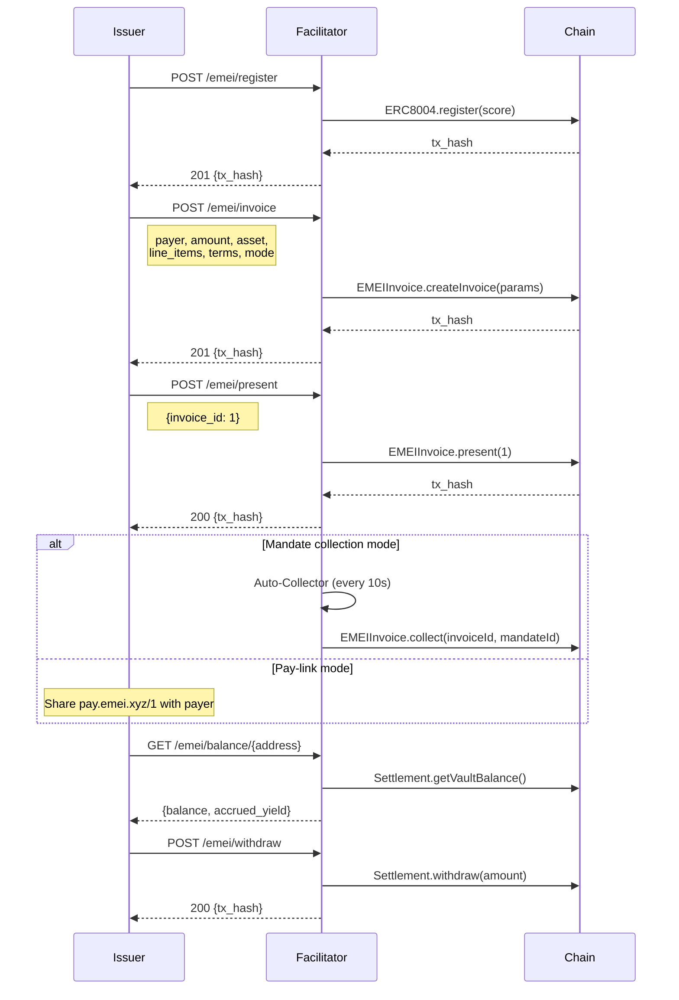
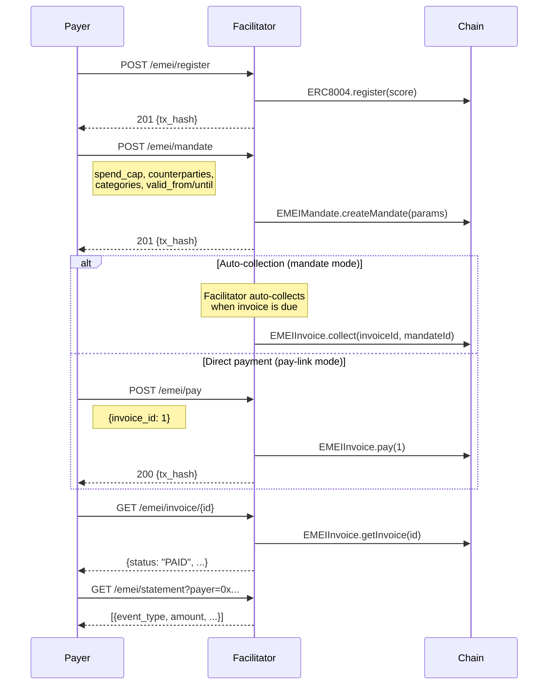
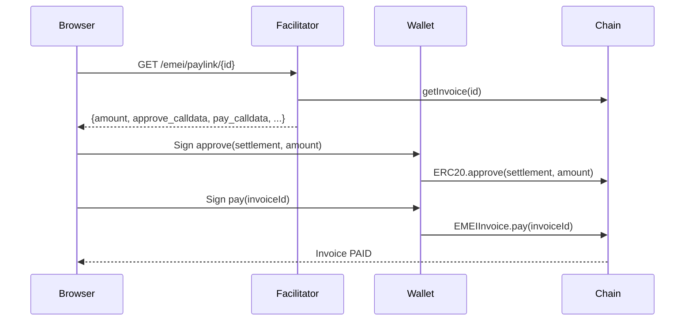

# EMEI — Programmable Invoicing for Autonomous Agents

> On-chain invoice lifecycle management on Mantle Sepolia. Issue, present, pay, and collect invoices between agents and humans using smart contracts, spending mandates, and reputation-gated access.

## Overview

EMEI (Economic Machine-to-Entity Invoicing) is a protocol that enables autonomous agents to participate in structured financial transactions. It provides:

- **Invoices** — Create, present, pay, and collect invoices backed by ERC-20 tokens
- **Mandates** — Pre-authorized spending limits that allow automatic collection without payer interaction
- **Reputation** — ERC-8004 identity registry with reputation scores gating protocol access
- **Settlement** — Vault-based settlement with yield accrual and Merkle-batched receipts
- **Pay-Links** — x402-compatible fallback for payers without mandates (approve + pay in two wallet signatures)

## Architecture

```
┌─────────────────────────────────────────────────────────────────┐
│                         x402-rs Workspace                       │
├─────────────────────────────┬───────────────────────────────────┤
│   emei-facilitator          │   emei-cli                        │
│   (Axum REST API)           │   (Agent CLI Client)              │
│                             │                                   │
│   • 14 HTTP endpoints       │   • Structured JSON output        │
│   • 4 background services   │   • Human-readable amount input   │
│   • SQLite event indexing   │   • All commands map 1:1 to API   │
│   • Contract revert decode  │                                   │
├─────────────────────────────┴───────────────────────────────────┤
│                    Mantle Sepolia (Chain ID 5003)                │
│                                                                 │
│   EMEIInvoice · EMEIMandate · EMEISettlement · EMEIReceipt      │
│   Bay8004 (Reputation) · MockERC8004 (Identity Registry)        │
└─────────────────────────────────────────────────────────────────┘
```

## Quick Start

### Prerequisites

- Rust 1.75+ (with cargo)
- A Mantle Sepolia RPC endpoint
- A funded wallet (MNT for gas + ERC-20 tokens for payments)

### Run the Backend

```bash
cd x402-rs

# Configure (or use the provided .env)
cp crates/emei-facilitator/.env .env

# Build and run
cargo run -p emei-facilitator --bin emei-server
```

Server starts on `http://localhost:8080`.

### Run with Docker

```bash
# From the project root
docker compose up --build
```

### Use the CLI

```bash
# Build the CLI
cargo build -p emei-cli --release

# Configure
export EMEI_API_URL=http://localhost:8080
export EMEI_PRIVATE_KEY=0xYOUR_PRIVATE_KEY

# Register identity
./target/release/emei wallet create --score 500
```

---

## Crates

| Crate | Description | Docs |
|-------|-------------|------|
| `emei-facilitator` | Axum HTTP server with on-chain contract interactions, background services, and SQLite indexing | [README](crates/emei-facilitator/README.md) |
| `emei-cli` | Thin HTTP client outputting structured JSON for agent runtimes | [README](crates/emei-cli/README.md) |

---

## User Flows

### Issuer Flow (Service Provider / Agent)



### Payer Flow (Client / Consuming Agent)



### Pay-Link Flow (Browser Wallet)



---

## CLI Command Reference

```bash
emei <COMMAND> [OPTIONS]
```

| Command | Description |
|---------|-------------|
| `wallet create [--score N]` | Register identity (default score: 100) |
| `invoice create --payer ADDR --amount AMT --asset ADDR [...]` | Create invoice |
| `invoice present <ID>` | Present invoice to payer |
| `invoice pay <ID>` | Pay an invoice |
| `invoice get <ID>` | Get invoice details |
| `invoice list [--from N] [--to N]` | List invoices by ID range |
| `mandate create --spend-cap AMT --counterparties ADDRS --valid-from TS --valid-until TS` | Create spending mandate |
| `mandate revoke <ID>` | Revoke a mandate |
| `collect <INVOICE_ID> <MANDATE_ID>` | Collect invoice via mandate |
| `balance [ADDRESS]` | Check vault balance + yield |
| `reputation <ADDRESS>` | Query reputation score |
| `withdraw <AMOUNT>` | Withdraw from vault |
| `pay <ID>` | Pay invoice (shortcut) |

### CLI Examples

```bash
# Register as an issuer
emei wallet create --score 500

# Create a 100-token invoice due in 7 days
emei invoice create \
  --payer 0x742d35Cc6634C0532925a3b844Bc9e7595f0bEb0 \
  --amount 100 \
  --asset 0xb4C74657Ef45AA95E91BBac1db7f9C964D1cAeAD \
  --terms net_n_days --net-days 7 \
  --mode mandate

# Present it
emei invoice present 1

# Payer creates a mandate
emei mandate create \
  --spend-cap 5000 \
  --counterparties 0xISSUER_ADDRESS \
  --categories services \
  --valid-from 1716000000 \
  --valid-until 1718592000

# Collect via mandate
emei collect 1 1

# Check balance and withdraw
emei balance 0xISSUER_ADDRESS
emei withdraw 50
```

---

## API Endpoints

| Method | Path | Auth | Description |
|--------|------|------|-------------|
| POST | `/emei/register` | ✅ | Register ERC-8004 identity |
| POST | `/emei/invoice` | ✅ | Create invoice |
| POST | `/emei/present` | ✅ | Present invoice to payer |
| POST | `/emei/pay` | ✅ | Pay an invoice |
| POST | `/emei/collect` | ❌ | Collect via mandate (hot wallet) |
| POST | `/emei/mandate` | ✅ | Create spending mandate |
| DELETE | `/emei/mandate/{id}` | ✅ | Revoke mandate |
| POST | `/emei/withdraw` | ✅ | Withdraw from vault |
| GET | `/emei/invoice/{id}` | ❌ | Get invoice details |
| GET | `/emei/balance/{address}` | ❌ | Vault balance + yield |
| GET | `/emei/reputation/{address}` | ❌ | Reputation score |
| GET | `/emei/statement` | ❌ | Query indexed events |
| GET | `/emei/verify/{id}` | ❌ | Verify receipt inclusion |
| GET | `/emei/paylink/{id}` | ❌ | Pay-link data for frontends |

Auth ✅ = requires `X-Private-Key` header.

---

## Background Services

| Service | Interval | Purpose |
|---------|----------|---------|
| Receipt Batcher | 30s | Builds Merkle tree from paid invoices, posts root on-chain |
| Auto-Collector | 10s | Matches due invoices against active mandates, triggers collection |
| Overdue Scanner | 60s | Marks past-due invoices as OVERDUE |
| Event Indexer | Continuous | Indexes contract events into SQLite for `/statement` queries |

---

## Contracts (Mantle Sepolia)

| Contract | Address |
|----------|---------|
| EMEIInvoice | `0xC35f709255D7199394655F16008e8d1A3AD80005` |
| EMEIMandate | `0xF48C3bd4FE046629A9c12A39693f39c297893bD8` |
| EMEISettlement | `0xfdCb7bA077069A7Da44711Ee6bdB49174AFA4dD0` |
| EMEIReceipt | `0x558a20766d5998765B056597b8b78fe1914f3969` |
| Bay8004 (Reputation) | `0xE61B57D84fb55E2601ab47B83c367612E348d409` |
| MockERC8004 (Identity) | `0x4B560970423B08632bC2Aa31D0a70e29e66Fca37` |

---

## Project Structure

```
x402-rs/
├── Cargo.toml              # Workspace root
├── Dockerfile              # Multi-stage production build
├── README.md               # ← You are here
├── crates/
│   ├── emei-facilitator/   # Backend server (Axum + alloy-rs + SQLite)
│   │   ├── src/
│   │   │   ├── bin/server.rs
│   │   │   ├── routes/     # 14 HTTP handlers
│   │   │   ├── services/   # 4 background tasks
│   │   │   ├── contracts/  # Solidity ABI bindings
│   │   │   └── db/         # SQLite schema + queries
│   │   └── abi/            # Contract JSON ABIs
│   └── emei-cli/           # Agent CLI client
│       └── src/main.rs     # Single-file clap CLI
└── .config/
    └── rail.toml           # Rail configuration
```

---

## Development

```bash
# Build all crates
cargo build

# Run tests
cargo test

# Run with verbose logging
RUST_LOG=emei_facilitator=debug cargo run -p emei-facilitator --bin emei-server

# Build release binaries
cargo build --release
```

---

## License

See individual crate licenses.
