# EMEI Facilitator

**Production-grade blockchain transaction orchestrator for the EMEI invoice protocol on Mantle Sepolia.**

The EMEI Facilitator is a high-throughput Rust backend that manages the full lifecycle of on-chain invoices — from creation through settlement — with durable transaction queuing, atomic nonce management, webhook-driven state confirmation, and a multi-wallet pool for concurrent transaction submission.

---

## Table of Contents

- [Architecture Overview](#architecture-overview)
- [Invoice Lifecycle](#invoice-lifecycle)
- [Transaction Queue & Wallet Pool](#transaction-queue--wallet-pool)
- [Nonce Management](#nonce-management)
- [Webhook Pipeline](#webhook-pipeline)
- [Background Workers](#background-workers)
- [State Machine](#state-machine)
- [Scaling: 1 Agent vs 1000 Agents](#scaling-1-agent-vs-1000-agents)
- [Database Schema](#database-schema)
- [API Reference](#api-reference)
- [Configuration](#configuration)
- [Running](#running)

---

## Architecture Overview

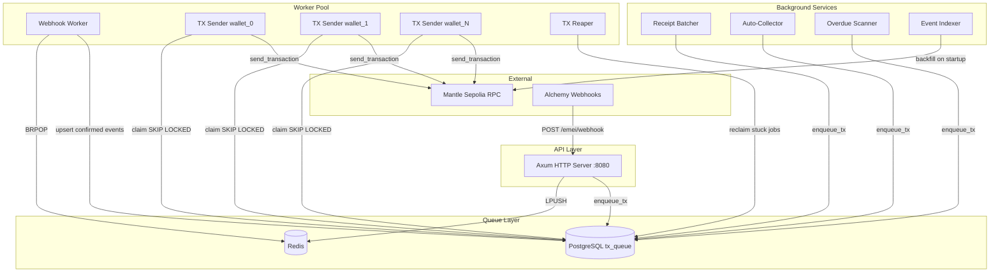

---

## Invoice Lifecycle

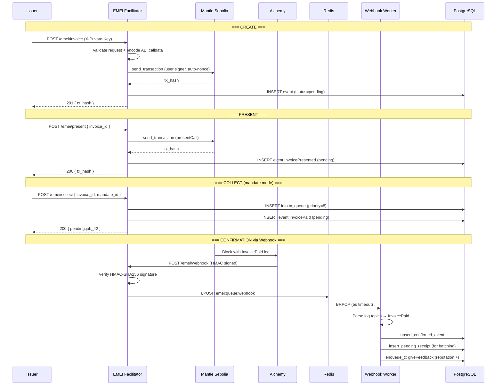

### Collection Modes

| Mode | Trigger | Signer | Flow |
|------|---------|--------|------|
| `pay_link` | Payer calls `POST /emei/pay` | User's private key | Direct on-chain tx, user pays gas |
| `mandate` | Auto-collector detects eligible invoice | Hot wallet pool | Enqueued to tx_queue, facilitator pays gas |

---

## Transaction Queue & Wallet Pool

The tx_queue is a PostgreSQL-backed durable job queue that guarantees every enqueued transaction eventually lands on-chain (or permanently fails after max retries).

### Job State Machine

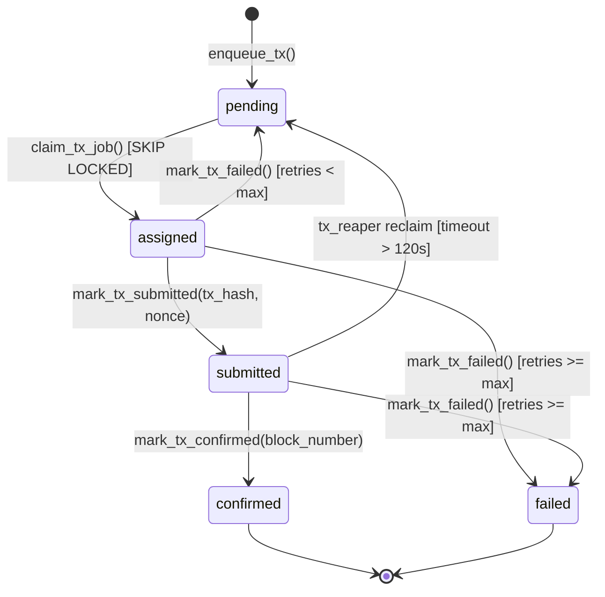

### How the Wallet Pool Works

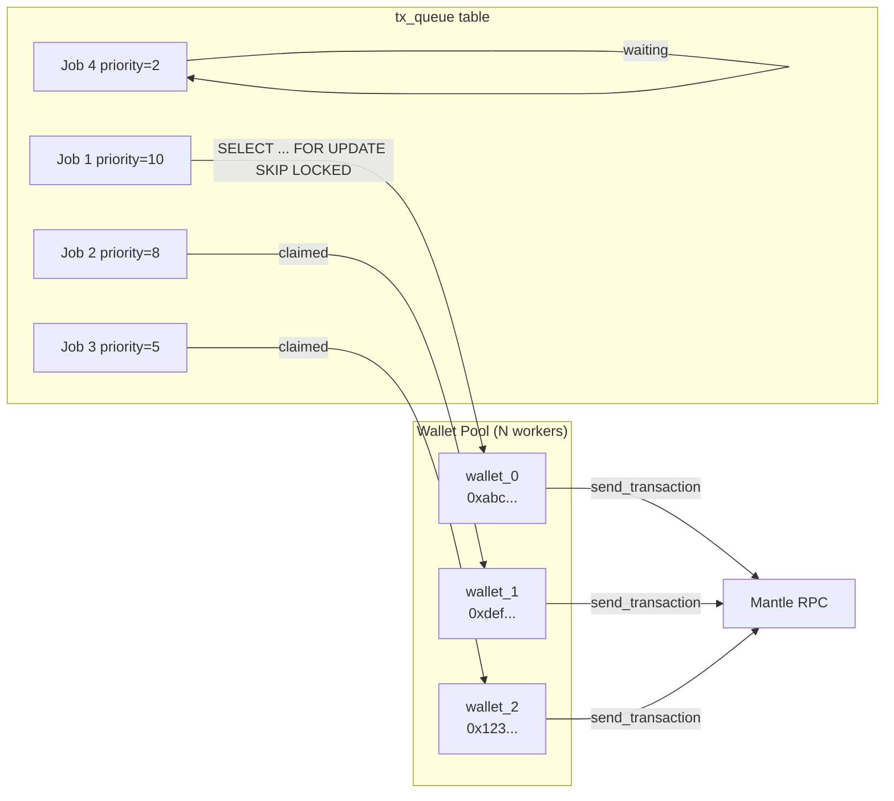

**Key design decisions:**

1. **`FOR UPDATE SKIP LOCKED`** — Multiple wallet workers poll concurrently. PostgreSQL's skip-locked ensures no two workers ever claim the same job, with zero contention.
2. **Priority ordering** — Jobs are claimed highest-priority-first (`ORDER BY priority DESC, id ASC`). Receipt batching (priority=10) > collect (priority=8) > overdue marking (priority=5) > reputation feedback (priority=3) > auto-collection (priority=2).
3. **Sequential per wallet** — Each wallet processes one job at a time. This eliminates nonce races within a single wallet.
4. **Automatic retry** — Failed jobs reset to `pending` if retries < max_retries (default 3). The tx_reaper reclaims stuck jobs every 2 minutes.

---

## Nonce Management

The system uses two nonce strategies depending on the transaction path:

### Strategy 1: Redis Atomic Nonce (Hot Wallet via `send_hot`)

Used by the legacy `ChainClient::send_hot()` path for direct hot wallet sends.

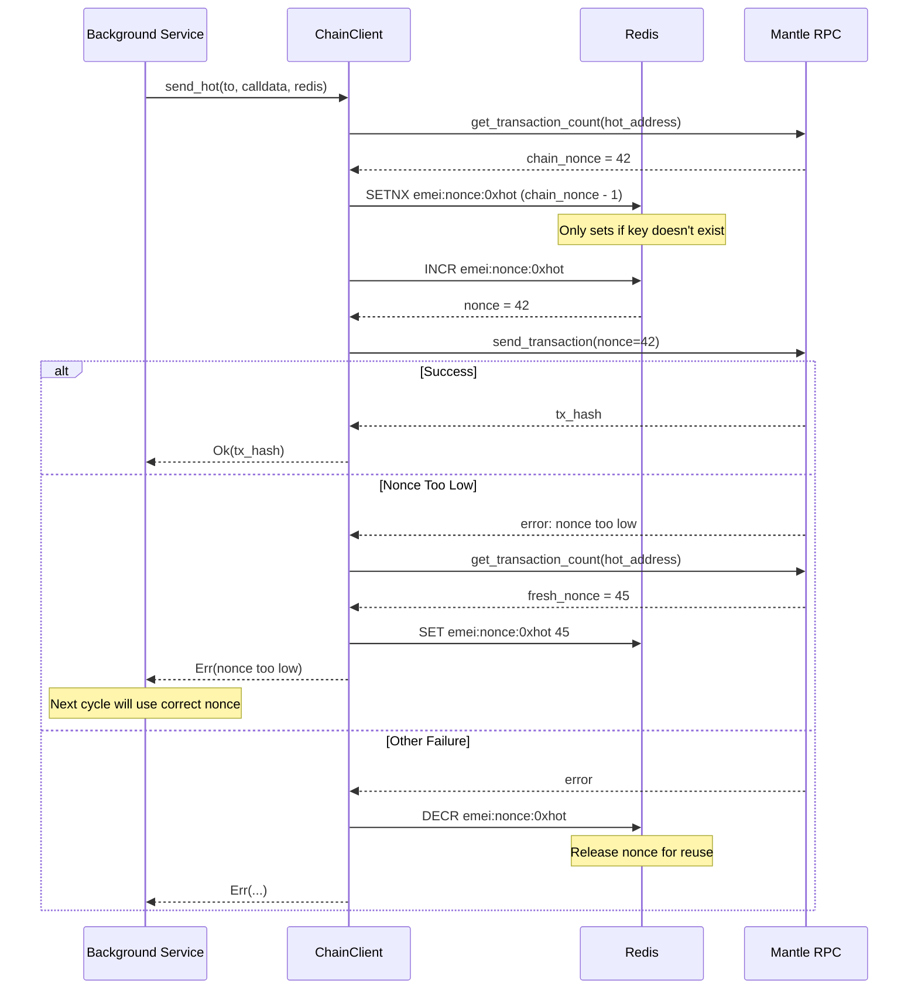

### Strategy 2: Provider Auto-Fill (TX Sender Workers)

Used by `tx_sender` workers. Since each wallet processes jobs sequentially, the provider's built-in nonce management is sufficient.

```
wallet_0: Job1 (nonce auto) → wait receipt → Job2 (nonce auto) → wait receipt → ...
wallet_1: Job3 (nonce auto) → wait receipt → Job4 (nonce auto) → wait receipt → ...
```

No nonce conflicts because:
- One worker per wallet key
- Sequential processing (wait for receipt before next job)
- Provider queries chain for current nonce on each send

### Why Two Strategies?

| Path | Concurrency | Nonce Strategy | Reason |
|------|-------------|----------------|--------|
| `send_hot()` | Multiple callers, one wallet | Redis INCR | Atomic counter prevents races when multiple services call simultaneously |
| `tx_sender` workers | One worker per wallet | Provider auto-fill | Sequential processing makes atomic counters unnecessary |

---

## Webhook Pipeline

Alchemy webhooks are the primary mechanism for confirming on-chain state changes. The pipeline is designed for exactly-once processing with idempotent writes.

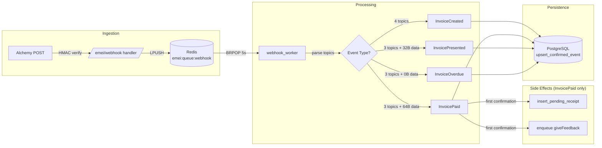

### Idempotency Guarantees

1. **Webhook deduplication** — `UNIQUE(tx_hash, log_index)` constraint. Duplicate webhooks are absorbed by `ON CONFLICT DO UPDATE SET status = 'confirmed'`.
2. **Side-effect guard** — Before triggering receipt queuing or reputation feedback, the worker checks `is_event_confirmed(tx_hash, log_index)`. Side effects only fire on the first confirmation.
3. **Two payload formats** — Supports both Alchemy Address Activity and Custom Webhook (GraphQL) formats transparently.

### Webhook Signature Verification

```
HMAC-SHA256(signing_key, raw_body) == x-alchemy-signature header (hex-encoded)
```

If `ALCHEMY_WEBHOOK_SIGNING_KEY` is not set, signature verification is skipped (development mode).

---

## Background Workers

All workers are spawned as Tokio tasks with graceful shutdown via `CancellationToken`.

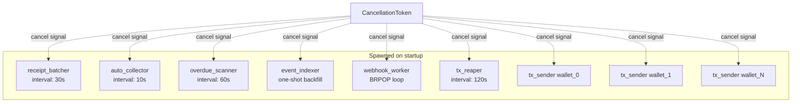

| Worker | Startup Delay | Interval | Purpose |
|--------|---------------|----------|---------|
| `receipt_batcher` | 0s | 30s | Drain pending receipts → Merkle tree → post root on-chain |
| `auto_collector` | 10s | 10s | Find PRESENTED mandate-mode invoices → enqueue collect |
| `overdue_scanner` | 20s | 60s | Find overdue invoices → mark on-chain + penalize reputation |
| `event_indexer` | 10s | one-shot | Backfill DB from chain if empty, then sleep forever |
| `webhook_worker` | 0s | continuous | BRPOP from Redis, process webhook payloads |
| `tx_reaper` | 30s | 120s | Reclaim stuck jobs (assigned/submitted > 2min) |
| `tx_sender` (×N) | 0s | 2s poll | Claim jobs from tx_queue, send, confirm |

### Receipt Batcher Deep Dive

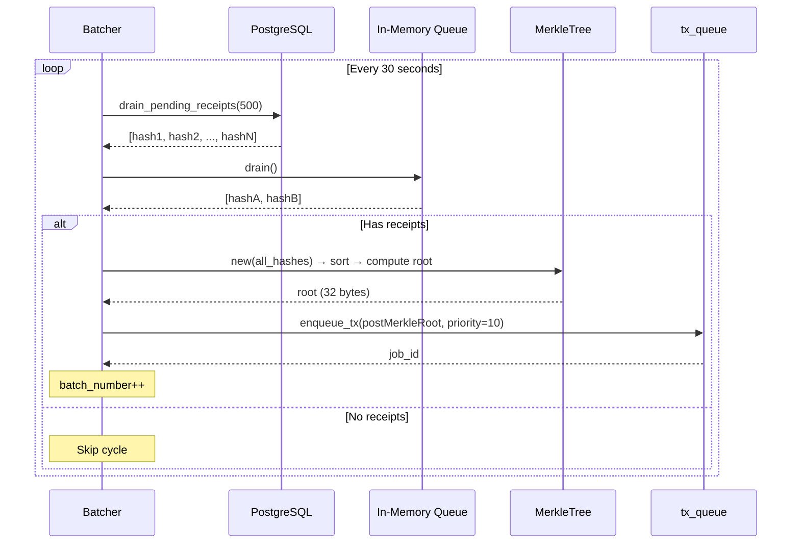

---

## State Machine

### Invoice On-Chain State

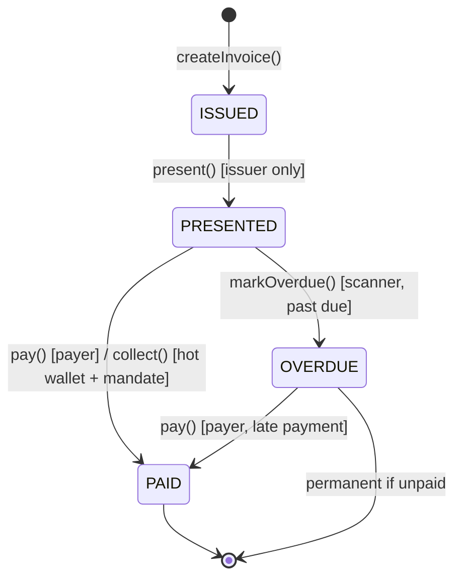

### Event Confirmation State (Database)

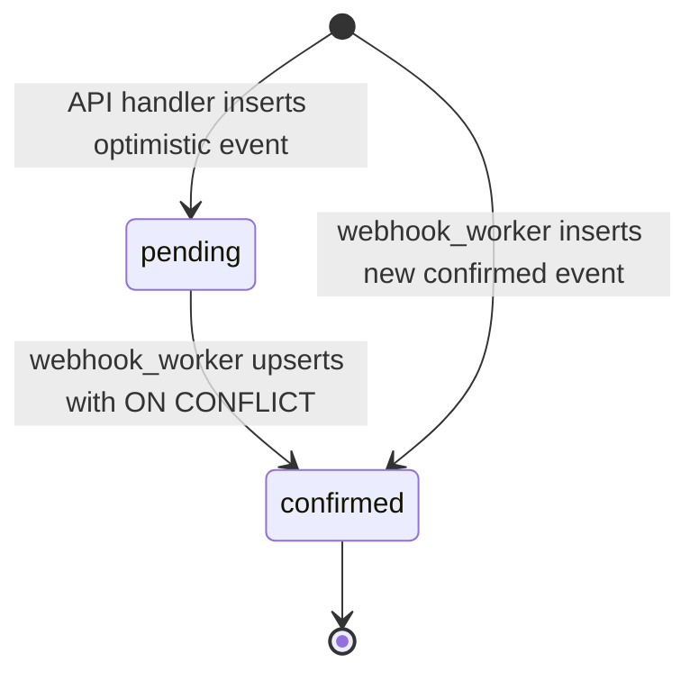

### TX Queue Job Lifecycle with Webhook Interaction

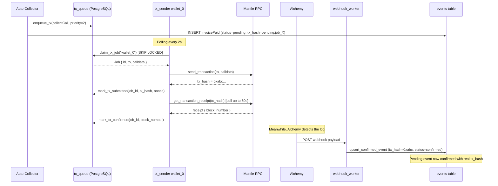

---

## Scaling: 1 Agent vs 1000 Agents

### Single Agent Scenario

```
Agent A creates invoice → presents → auto-collector finds mandate → collects

Timeline:
  t=0s   POST /emei/invoice (user signs, direct to chain)
  t=3s   POST /emei/present (user signs, direct to chain)
  t=10s  auto_collector detects PRESENTED + mandate → enqueue_tx
  t=12s  tx_sender claims job → sends → waits receipt
  t=18s  tx confirmed on-chain
  t=20s  Alchemy webhook → confirmed in DB → receipt queued
  t=30s  receipt_batcher posts Merkle root

Total: ~30s from present to settlement proof anchored
```

With 1 wallet, 1 agent: the system processes jobs sequentially. No contention, no nonce issues. The tx_sender polls every 2s, so worst-case latency from enqueue to send is 2s.

### 1000 Agents Scenario

```
1000 agents each create + present invoices simultaneously
→ 1000 collect jobs enqueued to tx_queue within seconds
→ Wallet pool processes them in parallel
```

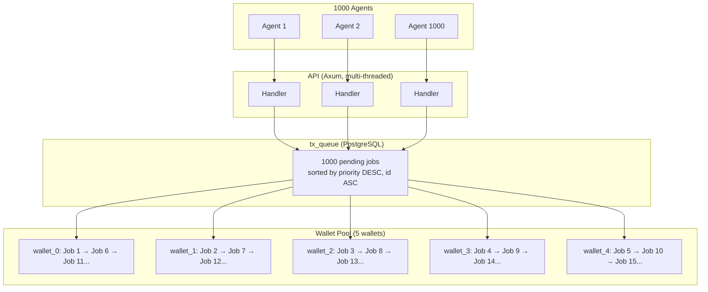

**Throughput calculation (5 wallets):**

| Metric | Value |
|--------|-------|
| Avg block time (Mantle) | ~2s |
| Tx confirmation time | ~6s (send + 2 confirmations) |
| Jobs per wallet per minute | ~10 |
| Total throughput (5 wallets) | ~50 tx/min |
| Time to drain 1000 jobs | ~20 minutes |
| Time to drain 1000 jobs (10 wallets) | ~10 minutes |

**Why this doesn't collapse under load:**

1. **No lock contention** — `SKIP LOCKED` means wallet workers never block each other. If wallet_0 is processing job 1, wallet_1 instantly claims job 2.
2. **No nonce races** — Each wallet is sequential. Wallet_0 always waits for its current tx receipt before claiming the next job.
3. **Backpressure is natural** — If the queue grows faster than wallets can drain it, jobs simply wait. No memory pressure (it's all in PostgreSQL).
4. **Priority ensures fairness** — High-priority jobs (receipt batching, explicit collects) always go first, even under load.
5. **Webhook processing is independent** — The webhook_worker runs on its own Redis queue. 1000 webhook payloads are processed sequentially but quickly (no chain calls, just DB writes).

### Scaling Levers

| Lever | How | Impact |
|-------|-----|--------|
| Add wallet keys | `EMEI_HOT_WALLET_KEYS=key1,key2,...` | Linear throughput increase |
| Increase PostgreSQL connections | `max_connections` in pool | More concurrent claims |
| Redis connection pooling | Already uses ConnectionManager | Handles webhook burst |
| Horizontal scaling | Multiple facilitator instances | All share same tx_queue via SKIP LOCKED |

---

## Database Schema

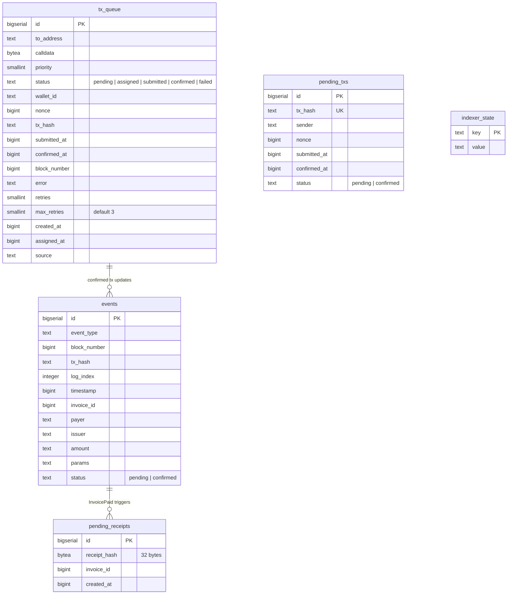

### Key Indexes

```sql
-- Fast job claiming (pending jobs by priority)
CREATE INDEX idx_tx_queue_pending ON tx_queue(priority DESC, id ASC) WHERE status = 'pending';

-- Wallet assignment lookup
CREATE INDEX idx_tx_queue_assigned ON tx_queue(wallet_id, status) WHERE status = 'assigned';

-- Event lookups
CREATE INDEX idx_events_payer ON events(payer);
CREATE INDEX idx_events_issuer ON events(issuer);
CREATE INDEX idx_events_invoice_id ON events(invoice_id);
CREATE INDEX idx_events_block_number ON events(block_number DESC);
```

---

## API Reference

### Invoice Lifecycle

| Endpoint | Method | Auth | Description |
|----------|--------|------|-------------|
| `/emei/invoice` | POST | `X-Private-Key` | Create a new invoice on-chain |
| `/emei/present` | POST | `X-Private-Key` | Present invoice to payer |
| `/emei/pay` | POST | `X-Private-Key` | Pay invoice directly (payer-initiated) |
| `/emei/collect` | POST | None | Collect via mandate (hot wallet, queued) |

### Mandate Management

| Endpoint | Method | Auth | Description |
|----------|--------|------|-------------|
| `/emei/mandate` | POST | `X-Private-Key` | Create spending mandate |
| `/emei/mandate/{id}` | DELETE | `X-Private-Key` | Revoke mandate |

### Query & Verification

| Endpoint | Method | Auth | Description |
|----------|--------|------|-------------|
| `/emei/invoice/{id}` | GET | None | Get invoice details from chain |
| `/emei/statement` | GET | None | Query events by payer (paginated) |
| `/emei/reputation/{addr}` | GET | None | Get on-chain reputation score |
| `/emei/balance/{addr}` | GET | None | Get vault balance + accrued yield |
| `/emei/verify/{id}` | GET | None | Verify receipt Merkle inclusion |
| `/emei/paylink/{id}` | GET | None | Get pre-encoded pay-link calldata |

### Identity & Withdrawal

| Endpoint | Method | Auth | Description |
|----------|--------|------|-------------|
| `/emei/register` | POST | `X-Private-Key` | Register identity (ERC-8004) |
| `/emei/withdraw` | POST | `X-Private-Key` | Withdraw from settlement vault |

### Operations & Monitoring

| Endpoint | Method | Description |
|----------|--------|-------------|
| `/health` | GET | Health check (RPC + DB status) |
| `/emei/webhook` | POST | Alchemy webhook receiver (HMAC) |
| `/emei/ops` | GET | HTML ops dashboard (auto-refresh) |
| `/emei/ops/status` | GET | JSON system internals |
| `/emei/ops/reset` | POST | Truncate all tables (danger) |
| `/emei/public/stats` | GET | Aggregated protocol stats |
| `/emei/public/events` | GET | Recent events (paginated) |
| `/emei/public/agents` | GET | Known agents with enriched data |
| `/emei/public/mandates` | GET | Active mandates across agents |

---

## Configuration

All configuration is via environment variables (loaded from `.env` via dotenvy).

### Required

| Variable | Description |
|----------|-------------|
| `EMEI_RPC_URL` | Mantle Sepolia RPC endpoint |
| `EMEI_HOT_WALLET_KEY` | Primary hot wallet private key (hex, 32 bytes) |
| `EMEI_INVOICE_ADDRESS` | EMEIInvoice contract address |
| `EMEI_MANDATE_ADDRESS` | EMEIMandate contract address |
| `EMEI_SETTLEMENT_ADDRESS` | EMEISettlement contract address |
| `EMEI_RECEIPT_ADDRESS` | EMEIReceipt contract address |
| `EMEI_BAY8004_ADDRESS` | Bay8004 reputation contract address |
| `EMEI_ERC8004_ADDRESS` | MockERC8004 identity registry address |
| `DATABASE_URL` | PostgreSQL connection string |
| `REDIS_URL` | Redis connection string |

### Optional

| Variable | Default | Description |
|----------|---------|-------------|
| `EMEI_HOT_WALLET_KEYS` | — | Additional wallet keys (comma-separated) for pool |
| `ALCHEMY_WEBHOOK_SIGNING_KEY` | — | HMAC key for webhook verification |
| `EMEI_BATCH_INTERVAL` | `30` | Seconds between receipt batching cycles |
| `EMEI_COLLECT_INTERVAL` | `10` | Seconds between auto-collection scans |
| `EMEI_OVERDUE_INTERVAL` | `60` | Seconds between overdue scans |
| `DEMO_AGENTS` | — | Comma-separated `label:address` pairs for dashboard |

---

## Running

```bash
# Install dependencies
cargo build --release

# Set up environment
cp .env.example .env
# Edit .env with your values

# Run migrations (automatic on startup)
# PostgreSQL and Redis must be running

# Start the server
cargo run --release --bin emei-server
```

The server binds to `0.0.0.0:8080` and spawns all background workers automatically.

### Health Check

```bash
curl http://localhost:8080/health
```

```json
{
  "status": "healthy",
  "rpc_reachable": true,
  "db_writable": true,
  "last_indexed_id": 0,
  "pending_receipts": 0,
  "version": "0.1.0",
  "chain_id": 5003
}
```

---

## Tech Stack

| Component | Technology |
|-----------|-----------|
| Language | Rust (2021 edition) |
| HTTP Framework | Axum |
| Async Runtime | Tokio (multi-threaded) |
| Blockchain | Alloy-rs (provider, signer, sol-types) |
| Database | PostgreSQL (sqlx, async) |
| Queue/Cache | Redis (connection-manager, async) |
| Webhook Auth | HMAC-SHA256 (hmac + sha2 crates) |
| Cryptography | Keccak256 (alloy-primitives) |
| Testing | proptest (property-based), tokio test-util |

---

## Contract Interactions

| Contract | Key Functions | Used By |
|----------|--------------|---------|
| EMEIInvoice | createInvoice, present, pay, collect, markOverdue, getInvoice | API routes, collector, scanner |
| EMEIMandate | createMandate, revokeMandate, getMandatesByPayer | API routes, collector |
| EMEISettlement | withdraw, getVaultBalance, getAccruedYield | API routes, dashboard |
| EMEIReceipt | postMerkleRoot, getLatestBatch, getMerkleRoot, verifyInclusion | Batcher, receipt verification |
| Bay8004 | scoreOf, giveFeedback | Webhook worker, scanner, dashboard |
| MockERC8004 | register | Identity registration |
